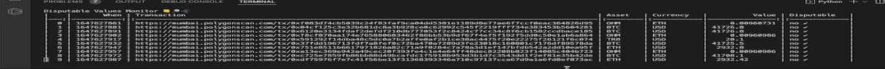

# Auto-disputer
A CLI dashboard & text alerts app for disputing bad values reported to Tellor oracles.



## Introduction

Tellor is an active oracle protocol on Ethereum that allows users to accept off-chain data from a distribtued network of data reporters. Given that the Tellor team does not put data on chain for users themselves, users desire to be able to monitor and dispute bad data automatically. Hence, Tellor created the Auto-disputer, which monitors the accuracy of a group of feeds selected by the user, sends a text to the user if a feed becomes inaccurate, and disputes the bad data on-chain to protect the user's protocol from bad data.

## Quickstart
```bash!
python3.9 -m venv venv  # incompatible with python 3.10
source venv/bin/activate
pip install tellor-disputables
mv venv/lib/python3.9/site-packages/vars.example.sh vars.sh
mv venv/lib/python3.9/site-packages/disputer-config.yaml disputer-config.yaml
chained add <name of new account> <private key> <chain id(s) separated by spaces>
# before proceeding, add environment variables to vars.sh
source vars.sh
cli -d  # the d is for dispute!
```
## Setup

### Prerequisites:
- Install Python 3.9
- Install [Poetry](https://github.com/python-poetry/poetry)
- Create an account on [twilio](https://www.twilio.com/docs/sms/quickstart/python)

### Update environment variables:
```bash
mv venv/lib/python3.9/site-packages/vars.example.sh vars.sh
```
Edit `vars.sh`:
- List phone numbers you want alerts sent to (`ALERT_RECIPIENTS`).
- From [twilio](https://www.twilio.com/docs/sms/quickstart/python), specify the phone number that will send messages (`TWILIO_FROM`), your `TWILIO_ACCOUNT_SID`, and access key (`TWILIO_AUTH_TOKEN`).
- Export environment variables:
```
source vars.sh
```

### Edit the chains you want to monitor

To edit the chains you want to monitor:
1. Initialize telliot configuration
Run `poetry run telliot config init`

This will create a file called `~/telliot/endpoints.yaml`, where you can list and configure the chains and endpoints you want to monitor.
You will need a chain_id, network name, provider name, and a url for an endpoint. You must at least enter a mainnet endpoint, along with any other chains you want to monitor. You also must delete any chains you do not want to monitor.
Here is an example.
```
- type: RPCEndpoint # do not edit this line
  chain_id: 1
  network: mainnet # name of network
  provider: infura # name of provider
  url: myinfuraurl... # url for your endpoint
```

You can list as many chains as you'd like.

### Configuring Tresholds

Monitored Feeds and their Thresholds are defined in the `disputer-config.yaml` file. You can move the config file to your current directory with
```
mv venv/lib/python3.9/site-packages/disputer-config.yaml disputer-config.yaml
```


By default, the auto-disputer will monitor the ETH/USD feed on any chain id with a threshold Percentage threshold of 75%. In the default `dipsuter-config.yaml`, attached to the project, this is represented as:

```yaml
# AutoDisputer configuration file
feeds: # please reference https://github.com/tellor-io/dataSpecs/tree/main/types for examples of QueryTypes w/ Query Parameters
  - query_id: "0x83a7f3d48786ac2667503a61e8c415438ed2922eb86a2906e4ee66d9a2ce4992"
    threshold:
      type: Percentage
      amount: 0.75 # 75%

```

Where `0x83a7f3d48786ac2667503a61e8c415438ed2922eb86a2906e4ee66d9a2ce4992` represents the `queryId` of the eth/usd feed on Tellor. It is derived from the solidity code
```solidity
queryId = abi.encode("SpotPrice", abi.encode("eth", "usd"));
```

### Usage:
```
cli -d
```

### Options
The available cli options are `-a`, `-av`, and `--wait`. You can use these options in any combination.

Use `-a` or `--account-name` to specify a `chained` account to use for disputing.
```bash
cli -a <your account name without quotes>
```

Use `-av` to get an alert for ALL `NewReport` events (regardless of whether they are disputable or not).
```bash
cli -av
```

Use `--wait` to set the wait time (in seconds) between event checks to reduce calls to the RPC endpoint. The default is seven seconds.
```bash
cli --wait 120
```

## How it works

The Auto-disputer is a complex event listener for any EVM chain, but specifically it listens for NewReport events on the Tellor network(s) the user wants to monitor.

When the Auto-disputer receives new NewReport events, it parses the reported value from the log, then compares the reported value to the trusted value from the Tellor reporter reference implementation, telliot.

In order to auto-dispute, users need to define what a "disputable value" is. To do this, users can set "thresholds" for feeds they want to monitor. Thresholds in the auto-disputer serve to set cutoffs between a healthy value and a disputable value. Users can pick from three types of thresholds: **range, percentage, and equality**.

### Range
**Range** -- if the difference between the reported value and the telliot value is greater than or equal to a set amount, dispute!

Ex. If the reported value is 250, and the telliot value is 1000, and the monitoring threshold is a range of 500, then the difference is 750 (it is >= to the range amount of 500), and the value is disputable! Therefore, a reported value of 501, in this case, would **not** be disputable. The smaller the range, the more strict the threshold.

### Percentage
**Percentage** -- if the difference between the telliot value and the reported value is greater than or equal to a set percentage of the telliot value, dispute! The smaller the percentage, the more strict the threshold.

Ex. If the reported value is 250, and the telliot value is 1000, and the percentage threshold is 0.50 (50%), then the percent difference is 75% of the telliot value (1000), and the value is disputable! Therefore, a reported value of 750, in this case, would **not** be disputable.

### Equality
**Equality** -- if there is any difference between the reported value and the telliot value, send a dispute!

Ex. If the reported value is "abc123", and the telliot value is "abc1234", then the value is disputable! However, to prevent false disputes due to checksummed addresses, the equality threshold sees "0xABC" and "0xabc" as equal.

## Considerations

**Range** thresholds best monitor high variance price feeds where the percent difference in price between sources is an unreliable indicator of a bad value. They are incompatibale, however, with non-numeric data feeds.

**Percentage** thresholds best monitor standard price feeds. The percentage is measured relative to the telliot value, not the reported value. In other words, if the telliot value is 1000, a 25% difference is 25% of 1000. Like range thresholds, percentage thresholds are incompatibable with non-numeric data feeds.

**Equality** thresholds best monitor data feeds where there is only one right answer. For example, `EVMCall` requests should be exactly equal to their expected telliot response. They aren't very useful for price feeds, though.

## Contributing:

- Install Python 3.9
- Install [Poetry](https://github.com/python-poetry/poetry)

Clone repo:
```bash
git clone https://github.com/tellor-io/disputable-values-monitor.git
```
Change directory:
```bash
cd disputable-values-monitor
```
Install dependencies with [Poetry](https://github.com/python-poetry/poetry):

```
poetry env use 3.9
poetry install
```


Run tests:
```
poetry run pytest
```
Format/lint code:
```
poetry run pre-commit run --all-files
```
Check type hinting:
```
poetry run mypy --strict src --implicit-reexport --ignore-missing-imports --disable-error-code misc
```
Generate requirements.txt in case you have installed new dependencies:
```
poetry export -f requirements.txt --output requirements.txt --without-hashes
```

### Publishing a release
1. Ensure all tests are passing on `main` branch.
2. Remove "dev" from version in the `pyproject.toml` file. Example: version = "0.0.5dev" --> version = "0.0.5".
3. On github, go to "Releases" -> "Draft a new release" -> "Choose a tag".
4. Write in a new tag that corresponds with the version in `pyproject.toml` file. Example: v0.0.5
5. If the tag is v.0.0.5, the release title should be Release 0.0.5.
6. Click Auto-generate release notes.
7. Check the box for This is a pre-release.
8. Click Publish release.
9. Navigate to the Actions tab from the main page of the package on github and make sure the release workflow completes successfully.
10. Check to make sure the new version was released to test PyPI [here](https://test.pypi.org/project/tellor-disputables/).
11. Test downloading and using the new version of the package from test PyPI ([example](https://stackoverflow.com/questions/34514703/pip-install-from-pypi-works-but-from-testpypi-fails-cannot-find-requirements)).
12. Navigate back to the pre-release you just made and click edit (the pencil icon).
13. Uncheck the This is a pre-release box.
14. Publish the release.
15. Make sure the release github action goes through.
16. Download and test the new release on PyPI official [here](https://pypi.org/project/tellor-disputables/).
17. Change the package version in **pyproject.toml** to be the next development version. For example, if you just released version 0.0.5, change **version** to be "0.0.6dev0".
